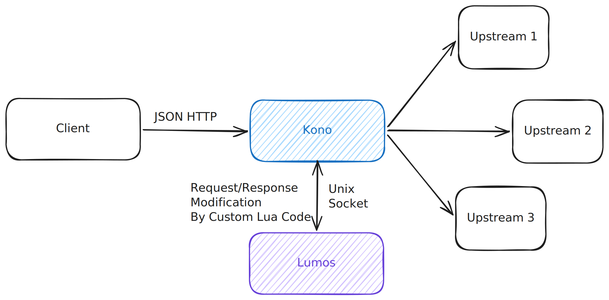

# Lumos

:::warning Experimental

Lumos is currently experimental. There is no stable SDK yet, and the wire protocol may change between releases.
We do not recommend using Lumos in production until a stable API is published.

:::

**Lumos** is Kono's built-in Lua scripting engine. It allows you to modify incoming requests before they are dispatched
to upstreams — without writing Go plugins or recompiling the gateway.

Lumos runs LuaJIT processes in the same container as the gateway. Communication happens over Unix sockets using a
length-prefixed JSON protocol, which eliminates the network overhead of a sidecar approach.

## How It Works
---

When a flow has scripts configured, Kono sends the incoming request to the Lumos worker over a Unix socket before
dispatching to upstreams. The script processes the request and returns one of two actions:

- `continue` — proceed with the request, optionally with modifications (method, path, query, headers)
- `abort` — reject the request immediately with a specified HTTP status code

```
Client → Kono → Lumos (Unix socket) → modified request → Upstreams
                       ↓ abort
                  HTTP error response
```

## Configuration
---

```yaml
flows:
  - path: /api/v1/users/{user_id}
    method: GET
    scripts:
      - source: file
        path: /etc/kono/scripts/auth.lua
    upstreams:
      - ...
```

| Field    | Type   | Description                          |
|----------|--------|--------------------------------------|
| `source` | string | Must be `file`                       |
| `path`   | string | Absolute path to the Lua script file |

Multiple scripts can be defined per flow. They execute sequentially — if any script returns `abort`, execution stops.

## Request Payload
---

The gateway sends the following JSON to the Lumos worker:

```json
{
  "request_id": "01j...",
  "method": "GET",
  "path": "/api/v1/users/42",
  "query": "include=details",
  "headers": {
    "Authorization": [
      "Bearer ..."
    ],
    "X-Forwarded-For": [
      "1.2.3.4"
    ]
  },
  "body": null,
  "client_ip": "1.2.3.4",
  "script_path": "/etc/kono/scripts/auth.lua"
}
```

## Response Format
---

The script must return a JSON response with an `action` field:

**Continue (with optional modifications):**

```json
{
  "action": "continue",
  "method": "GET",
  "path": "/api/v1/users/42",
  "query": "include=details",
  "headers": {
    "X-User-Id": [
      "42"
    ],
    "Authorization": [
      "Bearer ..."
    ]
  }
}
```

**Abort:**

```json
{
  "action": "abort",
  "http_status": 401,
  "error": "unauthorized"
}
```

## Wire Protocol
---

Lumos uses a length-prefixed binary protocol over the Unix socket:

```
[4 bytes: uint32 big-endian message length][N bytes: JSON payload]
```

Both the request from Kono and the response from the Lumos worker follow this format. This guarantees that partial reads
are detected correctly under load.

## Use Cases
---

- **Authentication** — validate JWT tokens, check API keys, reject unauthorized requests
- **Request enrichment** — add headers based on request context (e.g. inject user ID from token claims)
- **Path rewriting** — dynamically modify the upstream path based on request parameters
- **Conditional routing preparation** — modify query params or headers to influence upstream behavior

Flow with Lumos looks like this:
